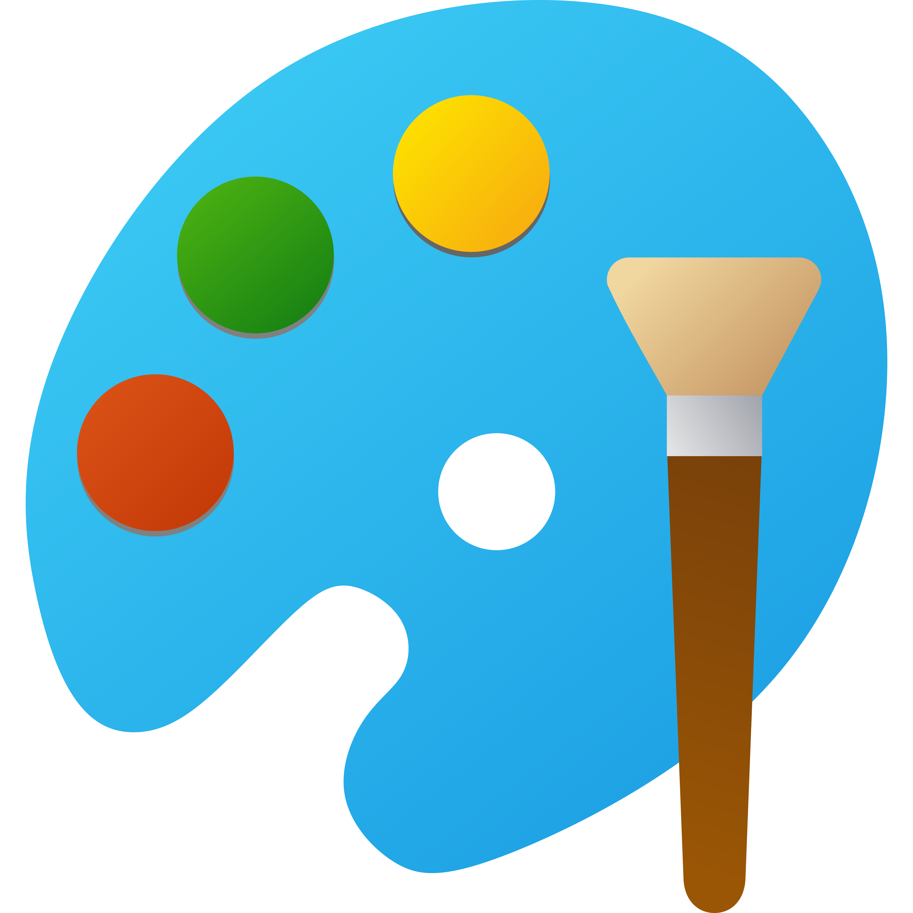

<h1 align = "center">Team Vektorina</h1>

<h2> About</h2>

We are a team that wants to present information about robots easily to the public.</b>

<h2> Technologies: </h2>

    
   
   

  
 

    
    
    

<h2 align = "center"> Our Team</h2>
  [Scrum trainer] 
  [Front-end Developer] 
  [Front-end Developer] 
  [Designer] 

